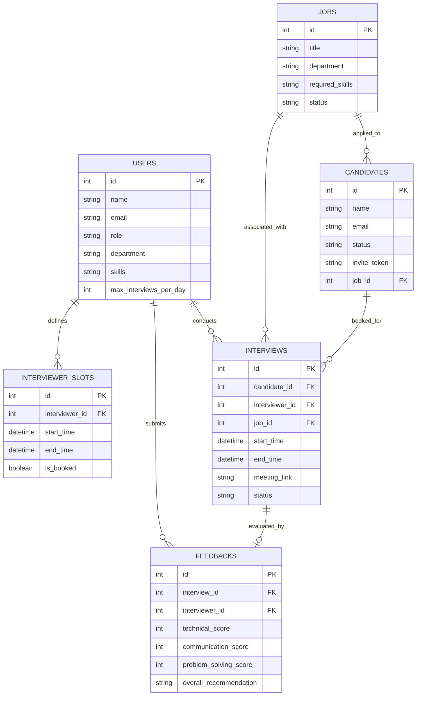

# AUTOMATED INTERVIEW SCHEDULING SYSTEM
## Comprehensive College Project Report & Viva Voce Preparation Guide

---

# PART 1: FORMAL PROJECT REPORT

## 1. Title & Abstract

### Project Title
**Automated Interview Scheduling & Evaluation System (AutoSchedule AI)**

### Abstract
In modern talent acquisition and campus recruitment drives, scheduling interviews involves high manual friction: back-and-forth email correspondence, interviewer fatigue, scheduling conflicts, and timezone mismatches. 

The **Automated Interview Scheduling System** is a full-stack web application that eliminates manual intervention by:
1. Matching candidate skill requirements with qualified panel interviewers using an automated relevance algorithm.
2. Filtering out scheduling conflicts, enforcing 15-minute buffer intervals, and capping daily interviewer workloads to prevent burnout.
3. Generating single-use, secure **Self-Service Candidate Booking Links** (`/book/{token}`) that allow candidates to select mutually viable slots in real-time.
4. Automatically generating and distributing RFC 5545 `.ics` calendar invites for seamless synchronization with Google Calendar, Microsoft Outlook, and Apple Calendar.
5. Providing structured post-interview evaluation scorecards that instantly update candidate hiring statuses (`HIRED` / `REJECTED`).

---

## 2. System Requirements Specification (SRS)

### 2.1 Hardware Requirements
- **Processor**: Intel Core i3 / AMD Ryzen 3 or higher
- **RAM**: Minimum 4 GB (8 GB recommended)
- **Disk Space**: 500 MB free hard disk space
- **Network**: Internet connection for CDN assets (Tailwind CSS, Alpine.js, Lucide Icons)

### 2.2 Software Requirements
- **Operating System**: Windows 10/11, macOS, or Linux
- **Runtime Environment**: Python 3.10+ (Tested on Python 3.11)
- **Database**: SQLite 3 (Embedded relational database)
- **Web Server**: Uvicorn (ASGI high-performance server)
- **Backend Framework**: FastAPI 0.100+
- **Frontend Stack**: HTML5, Tailwind CSS (via CDN), Alpine.js, Lucide Icons
- **Browser Compatibility**: Google Chrome, Mozilla Firefox, Microsoft Edge, Safari

---

## 3. System Analysis & Architecture

### 3.1 High-Level Architecture
The system follows a modern **Decoupled 3-Tier Architecture**:
1. **Presentation Layer (Frontend)**: Server-Side Rendered (SSR) HTML5 templates enriched with Alpine.js for client-side reactivity and Tailwind CSS for responsive styling. Zero node/npm compilation required.
2. **Application Layer (FastAPI Backend)**: RESTful APIs, Pydantic data validation, matching algorithm engine, and iCalendar generation services.
3. **Data Layer (SQLite & SQLAlchemy ORM)**: Relational tables with foreign key constraints, indices, and transactional integrity.

```
+-------------------------------------------------------------+
|                      PRESENTATION LAYER                     |
|  +--------------------+  +-------------------------------+  |
|  | Recruiter Dashboard|  | Candidate Self-Booking Portal |  |
|  +--------------------+  +-------------------------------+  |
|  +--------------------+  +-------------------------------+  |
|  | Interviewer Portal |  | Evaluation Scorecard          |  |
|  +--------------------+  +-------------------------------+  |
+-------------------------------------------------------------+
                              | HTTP / REST (JSON)
+-------------------------------------------------------------+
|                      APPLICATION LAYER                      |
|  +--------------------+  +-------------------------------+  |
|  | FastAPI Router Hub |  | Pydantic Validation Schemas   |  |
|  +--------------------+  +-------------------------------+  |
|  +--------------------+  +-------------------------------+  |
|  | Matching Engine    |  | RFC 5545 iCal (.ics) Service  |  |
|  +--------------------+  +-------------------------------+  |
+-------------------------------------------------------------+
                              | SQLAlchemy ORM
+-------------------------------------------------------------+
|                         DATA LAYER                          |
|  +-------------------------------------------------------+  |
|  |  SQLite Database (Users, Jobs, Candidates, Slots,      |  |
|  |                   Interviews, Feedbacks)              |  |
|  +-------------------------------------------------------+  |
+-------------------------------------------------------------+
```

---

## 4. Database Design & Entity Relationship (ER)

### 4.1 Schema Tables
1. **`users`**: Stores recruiter and interviewer accounts, departments, skills, and daily interview limits.
2. **`jobs`**: Job postings with required technical skills, department, and experience level.
3. **`candidates`**: Applicant details, applied job foreign key, current pipeline status, and secure invite token.
4. **`interviewer_slots`**: Time slots defined by interviewers with start/end datetimes and booking status.
5. **`interviews`**: Scheduled interview sessions with foreign keys to candidate, interviewer, and job, plus video meeting URL.
6. **`feedbacks`**: Scorecards containing technical, communication, and problem-solving ratings, plus hiring recommendations.



---

## 5. Mathematical & Algorithmic Design

### 5.1 Skill Match Score
The system computes the competency alignment between an interviewer's declared skills ($S_{\text{int}}$) and the job's required skills ($S_{\text{job}}$):
$$\text{Skill Match}(\%) = \frac{|S_{\text{int}} \cap S_{\text{job}}|}{|S_{\text{job}}|} \times 100$$

### 5.2 Conflict & Constraint Verification
For every prospective slot $S = [T_{\text{start}}, T_{\text{end}}]$ of interviewer $I$:
1. **Time Horizon Constraint**:
   $$T_{\text{start}} > T_{\text{now}}$$
2. **Buffer Overlap Constraint**: For all existing confirmed interviews $K \in \text{Interviews}(I)$:
   $$T_{\text{start}} < (K_{\text{end}} + \Delta_{\text{buffer}}) \quad \text{AND} \quad T_{\text{end}} > (K_{\text{start}} - \Delta_{\text{buffer}})$$
   *(where $\Delta_{\text{buffer}} = 15 \text{ minutes}$)*
3. **Workload Capacity Constraint**:
   $$\sum_{K \in \text{Interviews}(I), \text{Date}(K) = \text{Date}(S)} 1 < \text{MaxPerDay}(I)$$

---

## 6. Testing & Quality Assurance

| Test ID | Test Scenario | Input Data | Expected Result | Status |
| :--- | :--- | :--- | :--- | :--- |
| **TC-01** | Database Schema Creation | `Base.metadata.create_all()` | All 6 tables created in SQLite | **PASS** |
| **TC-02** | Initial Demo Seeding | `seed_database(db)` | 5 users, 3 jobs, 4 candidates, 48 slots | **PASS** |
| **TC-03** | Skill Matching Algorithm | Candidate for "Python Backend" | Returns slots with skill overlap score | **PASS** |
| **TC-04** | Slot Booking & Locking | Token + Slot ID #25 | Slot `is_booked=True`, Candidate status `SCHEDULED` | **PASS** |
| **TC-05** | Double Booking Prevention | Attempt to book already booked slot | System rejects with 400 Bad Request | **PASS** |
| **TC-06** | iCalendar (.ics) Generation | Confirmed Interview #3 | Valid RFC 5545 MIME byte stream produced | **PASS** |
| **TC-07** | Feedback Scorecard Submission | Technical: 5, Comm: 4, "STRONG_HIRE" | Interview `COMPLETED`, Candidate `HIRED` | **PASS** |

---

# PART 2: COMPREHENSIVE VIVA VOCE Q&A

### Category 1: Project Domain & Core Logic

#### Q1: What is the main objective of this project?
**Answer**: To automate the end-to-end interview scheduling and candidate evaluation lifecycle. It eliminates manual email scheduling, resolves calendar conflicts, enforces buffer intervals, prevents interviewer burnout through load balancing, and provides candidates with a self-service booking portal.

#### Q2: What is a "Magic Booking Link"?
**Answer**: It is a unique, secure URL containing a cryptographically generated token (e.g. `/book/a1b2c3d4e5f67890`). When a candidate opens this link, the system identifies their target job, queries the matching engine for qualified interviewer availability, and lets the candidate reserve a slot in real-time without requiring login credentials.

#### Q3: How does the system prevent double-booking?
**Answer**: 
1. The matching engine filters out slots where `is_booked == True`.
2. When a candidate confirms a slot, the system locks the slot within an atomic database transaction (`is_booked = True`) before creating the `Interview` record.
3. If two candidates submit simultaneously for the same slot, the transaction ensures only one succeeds while the other receives an error and is prompted to pick another slot.

#### Q4: How is load balancing among interviewers implemented?
**Answer**: The system monitors `max_interviews_per_day` per interviewer and tracks active interviews per calendar date. If an interviewer reaches their daily quota, their remaining slots for that day are hidden. Furthermore, the dashboard provides a visual workload distribution bar chart to help recruiters monitor interviewer utilization.

#### Q5: How does the video meeting link work?
**Answer**: When an interview is booked, the backend generates a secure, unique video room URL using open-source Jitsi Meet (`https://meet.jit.si/Interview-{job_id}-{candidate_id}-{slot_id}`). This requires no third-party API keys or paid subscriptions, allowing both candidate and interviewer to join with 1 click directly in the browser.

---

### Category 2: Backend, Python & FastAPI

#### Q6: Why did you choose FastAPI over Flask or Django?
**Answer**:
1. **Asynchronous Performance**: Built on Starlette and ASGI, FastAPI offers performance comparable to NodeJS and Go.
2. **Automatic OpenAPI/Swagger Documentation**: Automatically generates interactive API documentation at `/docs` without third-party plugins.
3. **Data Validation with Pydantic**: Eliminates manual input checking by automatically parsing and validating JSON request bodies.
4. **Dependency Injection**: FastAPI’s `Depends(get_db)` provides clean, modular database session lifecycle management.

#### Q7: What is ASGI and how does it differ from WSGI?
**Answer**: 
- **WSGI (Web Server Gateway Interface)**: Synchronous protocol used by Flask and Django. It handles one request per worker thread at a time.
- **ASGI (Asynchronous Server Gateway Interface)**: Used by FastAPI and Uvicorn. It supports asynchronous execution (`async/await`), enabling concurrency, non-blocking I/O, WebSockets, and long-polling.

#### Q8: What role does SQLAlchemy play in this system?
**Answer**: SQLAlchemy acts as the Object-Relational Mapper (ORM). It abstracts SQL queries into Python objects, maps database tables to Python classes, manages transactions, and ensures code portability across different database engines (e.g., SQLite in development, PostgreSQL in production).

#### Q9: What is Pydantic and how is it used here?
**Answer**: Pydantic is a data validation library. In this project, Pydantic schemas (in `schemas.py`) enforce type safety, validate incoming JSON payloads (e.g., verifying score ranges 1–5 for feedback), and serialize database models into clean API responses.

---

### Category 3: Database & Architecture

#### Q10: Why did you use SQLite for this project?
**Answer**:
- SQLite is an embedded, serverless, zero-configuration relational database stored as a single file (`interview_scheduler.db`).
- It is lightweight, requires no external database server installation, and supports full ACID compliance, making it ideal for academic projects and demos.

#### Q11: What are the foreign keys and relationships in your database?
**Answer**:
- `Candidate.job_id` &rarr; `Job.id` (Many-to-One)
- `InterviewerSlot.interviewer_id` &rarr; `User.id` (Many-to-One)
- `Interview.candidate_id` &rarr; `Candidate.id` (Many-to-One)
- `Interview.interviewer_id` &rarr; `User.id` (Many-to-One)
- `Interview.job_id` &rarr; `Job.id` (Many-to-One)
- `Feedback.interview_id` &rarr; `Interview.id` (One-to-One)

#### Q12: How are database transactions handled?
**Answer**: In `database.py`, the `get_db()` generator yields a database session per request. Operations are wrapped in `db.commit()` on success or rolled back on failure, with `db.close()` called in a `finally` block to release database locks.

---

### Category 4: Frontend & Standards

#### Q13: What is the benefit of using Tailwind CSS and Alpine.js via CDN?
**Answer**:
1. **Zero Build Step**: Eliminates the need for Node.js, npm, Webpack, or Vite.
2. **Instant Deployment**: Runs immediately on any computer with Python installed.
3. **Reactivity**: Alpine.js provides reactive state management (`x-data`, `x-model`, `x-for`) with a declarative syntax similar to Vue.js, but directly inside HTML templates.

#### Q14: What is RFC 5545 and how does the `.ics` calendar download work?
**Answer**: RFC 5545 is the international internet standard for calendar data exchange (iCalendar). The system uses the Python `icalendar` library to construct a `.ics` file containing `VEVENT` components (`DTSTART`, `DTEND`, `SUMMARY`, `ORGANIZER`, `ATTENDEE`, `LOCATION`). When downloaded, modern operating systems and calendar apps (Google Calendar, Outlook) automatically parse and add the meeting.

---

### Category 5: Future Enhancements

#### Q15: What features can be added in future versions?
**Answer**:
1. **AI Resume Screening**: Using NLP to automatically match candidate resume keywords against job requirements before issuing invite links.
2. **Automated Video Transcription & Sentiment Analysis**: Real-time speech-to-text during interviews to assist interviewers in drafting scorecards.
3. **Two-Way Google / Microsoft Calendar Sync**: Integrating Google Calendar API and Microsoft Graph API to automatically sync interviewer availability without manual slot entry.
4. **SMS / WhatsApp Notifications**: Integrating Twilio for instant mobile interview reminders.
