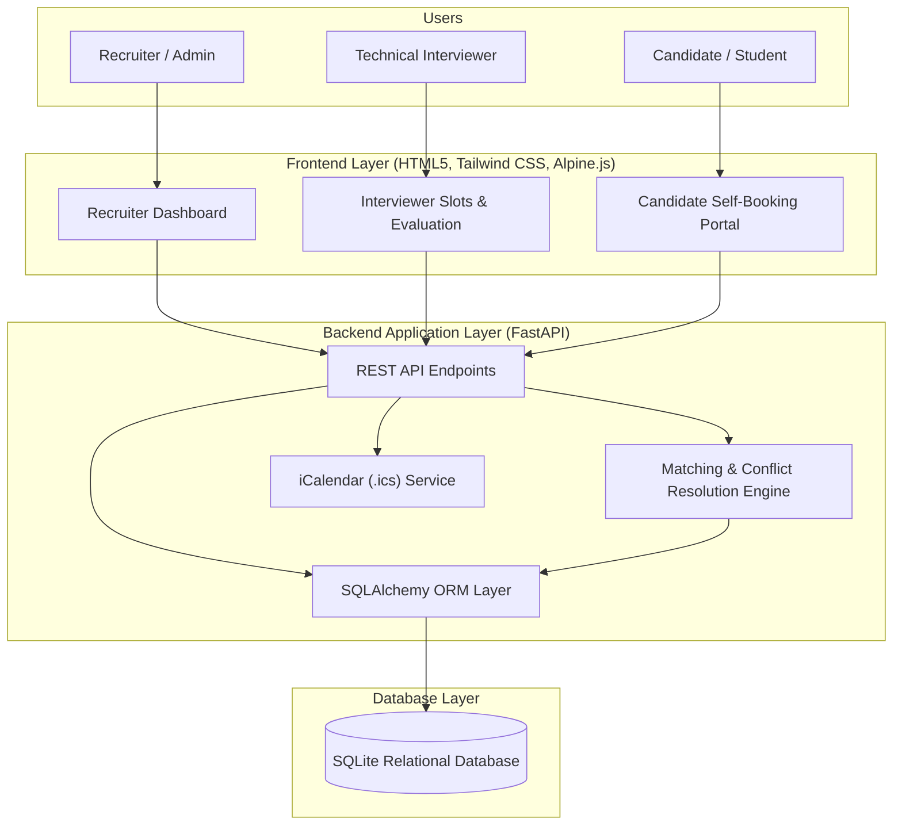
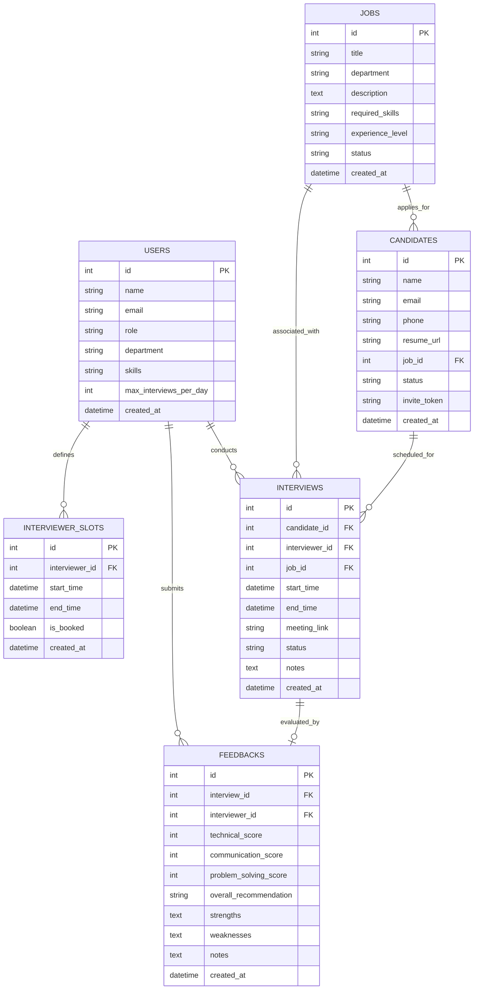

# Automated Interview Scheduling System

> **College Project Edition** — An end-to-end, full-stack intelligent interview scheduling and evaluation platform engineered to automate recruitment workflows, eliminate email back-and-forth, balance interviewer workloads, and resolve scheduling conflicts.

[](https://render.com/deploy?repo=https://github.com/Amanrahangdale242006/Flexi-sem-5)

---

## 📌 1. Project Overview & Abstract

### Problem Statement
Traditional interview scheduling in corporate recruitment and college placement drives suffers from significant inefficiencies:
1. **Email Tag / Communication Lag**: Recruiters, candidates, and panel interviewers exchange multiple emails over days just to align on a single 45-minute slot.
2. **Interviewer Fatigue & Imbalance**: Without automated workload balancing, certain interviewers are overburdened while others remain underutilized.
3. **Skill Mismatch**: Panels are often assigned without verifying skill alignment with the job requirements.
4. **Double Booking & Timezone Conflicts**: Manual calendar tracking leads to overlapping interviews and missed meetings.

### Proposed Solution
The **Automated Interview Scheduling System** solves this through:
- **Intelligent Slot Matching Algorithm**: Computes the optimal intersection of interviewer skills, calendar availability, candidate preferences, and daily interviewer capacity.
- **Candidate Self-Service Booking Portal**: Generates unique, secure magic links (`/book/{token}`) allowing candidates to pick from real-time conflict-free slots.
- **Automated Calendar Synchronization**: Instant generation of RFC 5545 `.ics` calendar invites for Google Calendar, Microsoft Outlook, and Apple Calendar.
- **Interviewer Evaluation & Scorecard System**: Structured post-interview feedback forms that automatically update hiring pipeline status.
- **Real-Time Recruiter Analytics Dashboard**: Live metrics tracking candidate conversion rates, interviewer workload balancing, and upcoming interview pipelines.

---

## 🏗️ 2. System Architecture



---

## 🧠 3. Automated Scheduling & Matching Algorithm

The matching engine employs a multi-stage filtering and load-balancing strategy:

1. **Skill Relevance Score Calculation**:
   $$\text{Match Score} = \frac{|\text{Interviewer Skills} \cap \text{Job Required Skills}|}{|\text{Job Required Skills}|} \times 100\%$$
   Interviewers with higher overlap are prioritized.

2. **Temporal & Capacity Constraints**:
   For each qualified interviewer and each candidate slot:
   - **Future Constraint**: $\text{Slot Start} > \text{Current Time}$
   - **Conflict Constraint**: $\text{Slot Start} < \text{Existing Interview End} + \text{Buffer}$ AND $\text{Slot End} > \text{Existing Interview Start} - \text{Buffer}$
   - **Daily Quota Constraint**: $\text{Interviews On Date}(i) < \text{Max Daily Interviews}(i)$

3. **Load Balancing**:
   When multiple interviewers are eligible for a given time slot, the engine assigns the slot to the interviewer with the lowest interview count to maintain fair distribution.

---

## 🗄️ 4. Database Schema & ER Diagram



---

## 🚀 5. Quick Setup & Execution Guide

### Prerequisites
- **Python 3.10+** (Tested on Python 3.11)
- Modern web browser (Chrome, Edge, Firefox, Safari)

### Installation
1. Open terminal / command prompt in this project folder:
   ```bash
   cd "flexi project"
   ```
2. Install dependencies:
   ```bash
   python -m pip install -r requirements.txt
   ```
3. Run the application:
   ```bash
   python run.py
   ```
4. Open your browser and navigate to:
   - **Dashboard**: `http://127.0.0.1:8000/`
   - **Swagger API Docs**: `http://127.0.0.1:8000/docs`

---

## 🎯 6. Key Features & How to Demo for Viva

### 1. Recruiter Dashboard (`http://127.0.0.1:8000/`)
- Demonstrates real-time metrics (Total, Scheduled, Completed, Pipeline status).
- Displays live **Interviewer Load Balancing** progress bars.
- Action buttons to join meeting room, download `.ics`, submit feedback, or cancel interviews.

### 2. Candidate Pipeline & Self-Booking (`http://127.0.0.1:8000/candidates`)
- Click **"Invite New Candidate"** to add a candidate.
- Notice the automatically generated **Magic Booking Link**.
- Click the **external link icon** or copy the link to open the candidate portal in a new tab.

### 3. Candidate Self-Booking Experience (`/book/{token}`)
- Displays role requirements, interview format, and skill focus.
- The matching engine dynamically calculates and shows available slots with **Skill Match Scores**.
- Candidate picks a slot, enters optional notes, and clicks **"Confirm Interview"**.
- Slot locks immediately (preventing double-booking) and presents an instant **"Add to Calendar (.ics)"** download button!

### 4. Interviewer Availability Management (`http://127.0.0.1:8000/interviewers`)
- View panel interviewers, departments, and skill badges.
- Click **"Manage Slots"** &rarr; click **"Auto-Generate Slots"** to create a 7-day schedule with 1 click!

### 5. Evaluation Scorecard (`/feedback/{interview_id}`)
- Interviewers rate Technical, Communication, and Problem Solving skills on a 1-5 scale.
- Submit hiring recommendation (`STRONG_HIRE`, `HIRE`, `HOLD`, `REJECT`).
- Candidate status automatically synchronizes to `HIRED` or `REJECTED`.

### 6. Presentation Reset Button
- A **"Reset Demo Data"** button in the top navigation header instantly restores clean sample data for demonstrations.

---

## 🎓 7. College Viva Q&A Guide

#### Q1: What makes this project an "Automated" system rather than just a CRUD calendar?
**Answer**: The core intelligence lies in the **Matching & Scheduling Engine**. Instead of a human manually reviewing resumes and interviewer calendars, the engine:
1. Parses required job skills and interviewer competencies.
2. Filters out conflicts, enforces buffer times, and checks daily interviewer capacity.
3. Automatically balances interview distribution across panel members.
4. Generates single-use self-service booking links that lock slots in real-time.

#### Q2: How is double-booking prevented in concurrent requests?
**Answer**: In the database layer, the slot booking transaction checks `is_booked == False` before updating the status to `True`. If two candidates attempt to book the same slot simultaneously, the transaction succeeds for the first and raises a validation error for the second, prompting them to select another slot.

#### Q3: Why choose FastAPI over Django or Flask?
**Answer**:
- **High Performance**: FastAPI is built on Starlette and Pydantic, offering asynchronous performance comparable to Node.js and Go.
- **Automatic OpenAPI Documentation**: Automatically generates interactive Swagger UI documentation at `/docs`.
- **Type Safety & Data Validation**: Pydantic schemas enforce strict validation for request bodies and query parameters.

#### Q4: How is calendar synchronization implemented?
**Answer**: The system implements the **RFC 5545 iCalendar standard** via the `icalendar` library. When an interview is booked, an `.ics` MIME payload is generated containing `DTSTART`, `DTEND`, `UID`, `ORGANIZER`, `ATTENDEE`, and `LOCATION` fields, compatible with Google Calendar, Microsoft Outlook, and Apple Calendar.

---

## 👥 Contributors & License
- Developed as an Academic Project for Software Engineering / Full Stack Development.
- Open Source under the MIT License.
